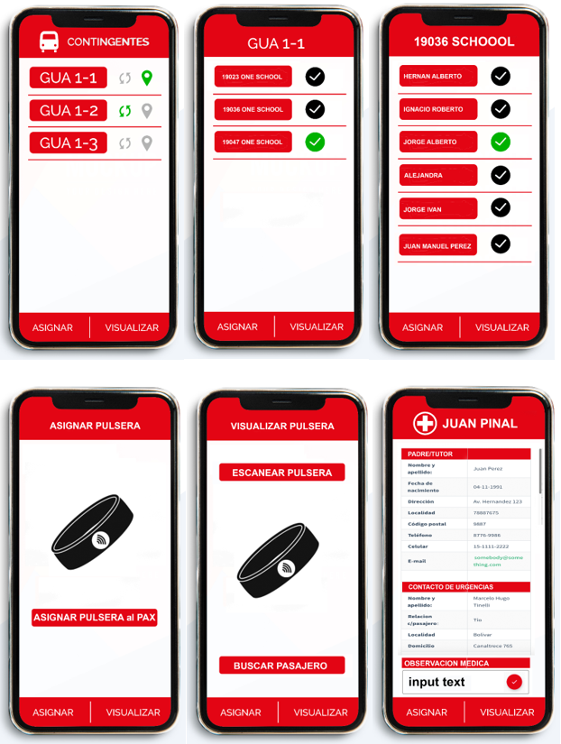

# Tourst Management APP with React Native RFID SCAN
 This app is for the tourist coordinator who can manage the school’s passengers.
## Outline 
 This app is for the tourist coordinator who can manage the school’s passengers.
 This app provides the interface to manage the groups, schools, and passengers.
## Main feature 
 The coordinator can assign the rfid card for each passenger and after assign the coordinator can read the information of the passenger with rfid scanning.
 The app transmits his location information in the background mode with the user has selected the group id.
 For each group, the user can synchronize the date to store all date of the group in the local, so that the app can be used in the offline mode.
 Each passenger has the medical information and the user can read it and edit the medical observation data with app.
## Build and Development
 This app is developed with react native.
 RN version: RN 0.61
 Target: Android and iOS
## Extra point
 This app has the ability of   Ndef writing, get UID of tag, send mifare command and APDU exchange and so on.
## Contact
 Email: sunrise098@outlook.com

